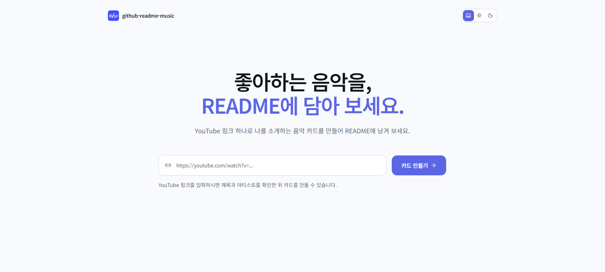

# github-readme-music

YouTube 링크 하나로 GitHub README에 담을 나만의 음악 카드를 만들어 보세요.

[github-readme-music 사용하기](https://github-readme-music.vercel.app)

## 소개

GitHub README는 나를 소개하고, 내가 좋아하는 것을 보여 주는 공간입니다. github-readme-music은 YouTube 링크 하나로 음악 카드를 만들어 README에 나만의 취향을 자연스럽게 담을 수 있도록 만든 서비스입니다.

YouTube 링크를 입력하면 영상의 제목, 채널명, 재생 시간, 썸네일을 바탕으로 카드를 만들고, 완성된 Markdown을 바로 복사해 GitHub README에 사용할 수 있습니다.

## 서비스 화면

## 주요 기능

- YouTube 영상의 제목, 채널명, 재생 시간, 썸네일 자동 조회
- 일반형 · 가로형 · 세로형의 세 가지 카드 형태 제공
- 제목·아티스트 수정, 재생 위치 설정, 썸네일 영역 조정
- 색상, 그라데이션, 테두리, 웨이브폼을 활용한 카드 커스터마이즈
- GitHub README에 바로 붙여 넣을 수 있는 SVG 카드와 Markdown 생성
- 카드 클릭 시 설정한 재생 위치의 YouTube 영상으로 이동

## 사용 방법

1. [github-readme-music](https://github-readme-music.vercel.app)에 YouTube 링크를 입력합니다.
2. 카드 형태와 디자인을 선택하고, 필요하면 제목·아티스트·썸네일 영역을 수정합니다.
3. `README 삽입 코드`를 복사합니다.
4. GitHub 프로필 저장소 또는 프로젝트 저장소의 `README.md`에 붙여 넣고 커밋합니다.

생성된 카드는 SVG로 제공됩니다. YouTube 썸네일을 카드 안에 포함해 GitHub README에서도 앨범 커버가 안정적으로 표시되도록 처리했습니다.

## 카드 형태

| 형태 | 규격 | 특징 |
| --- | --- | --- |
| 일반형 | 380 × 181 | 제목, 가수, 재생바와 컨트롤을 균형 있게 보여주는 기본 카드 |
| 가로형 | 460 × 48 | README의 좁은 영역에 잘 어울리는 컴팩트 카드 |
| 세로형 | 260 × 416 | 앨범 커버와 음악 정보를 더 강조하는 카드 |

### 기본 카드 예시

#### 일반형

  

#### 가로형

  

#### 세로형

  

## 기술 스택

Next.js · React · TypeScript · Tailwind CSS · shadcn/ui · YouTube Data API v3 · Vercel · Vercel Web Analytics · Sentry
